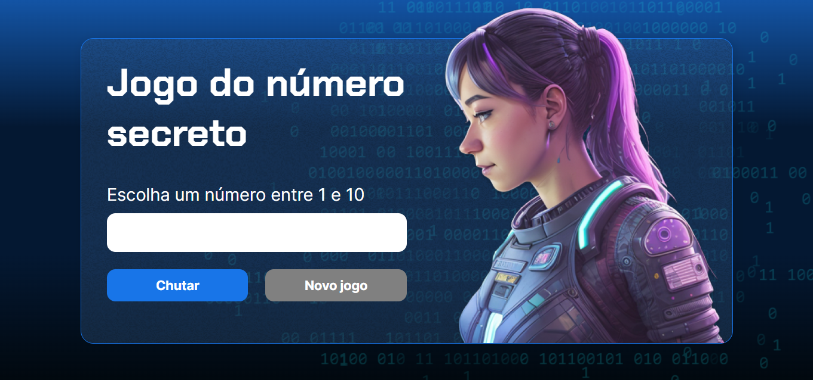

<div align="center">

</div>

## ✳️ Descrição do projeto

 O objetivo desse projeto foi criar um jogo em que o usuário tem que acertar o número de 1 a 10, sendo que a cada tentativa errada, o sistema contabiliza o chute. Quando o usuário acertar o número, o texto é renderizado para a quantidade de vezes que ele tentou antes de acertar.
 Além disso, o sistema foi configurado para interagir com o usuário utilizando a voz do Google, dando dicas se o número é maior ou menor e quando o usuário acerta o número.


## 🌎 Link do site

https://secret-number-lac.vercel.app/


## 💻 Tecnologias utilizadas 

Projeto foi desenvolvido utilizando as seguintes tecnologias:

- Linguagem HTML, CSS e JavaScript.

## ▶️ Como executar o projeto

- Clonar o repositório 

``` sh
https://github.com/EduardoPSRodrigues/SecretNumber.git
```

- Instalar a extensão Live Server - v5.7.9 de Ritwick Dey

- Depois no canto inferior direito selecionar Go Live para iniciar o servidor


|    Autor    |  GitHub   |   Linkedin  | 
|  :---: | :---:  | :---: |
|   | Eduardo Rodrigues :: [@EduardoPSRodrigues](https://github.com/EduardoPSRodrigues) | [Meu Perfil](https://www.linkedin.com/in/eduardo-rodrigues-a1a0792a4/) |
